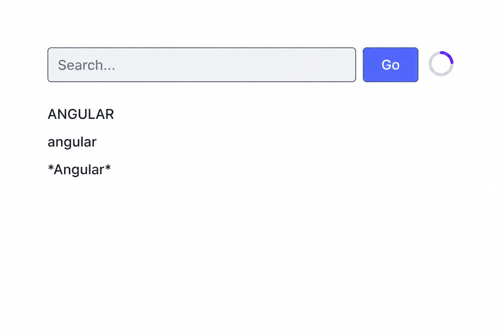

# Practice 3: Search Application

In this practice, we will build a small search application and use it to connect an Angular component's view model to its view.

The application will let the user enter a keyword and start a simulated search. While the search is running, it will display an animated spinner and disable the controls. When the search finishes, it will display three transformed versions of the keyword.




## Run the application

Start the development server:

```bash
ng serve
```

Open `http://localhost:4200/` in the browser and try several searches. 

## 1. Create the view model

Open `src/app/app.ts` and create the state and actions for the application.

We will store the component state in three signals:

- `keyword` stores the current search text.
- `busy` indicates whether a search is in progress.
- `results` stores the list of search results.

We will also add two actions:

- `setKeyword` receives a string and updates the `keyword` signal.
- `search` starts the simulated search.

The `search` action will:

1. Set the busy state to `true`.
2. Clear any previous results.
3. Wait for three seconds using `setTimeout`.
4. Create three results from the keyword: uppercase, lowercase, and surrounded by asterisks.
5. Set the busy state back to `false`.

## 2. Create the view

Open `src/app/app.html` and build the user interface. It will contain:

- A search box.
- A **Go** button.
- An `img` element that points to an animated spinner GIF.
- An area that displays the search results.

> Optional: Place the animated GIF at `public/spinner.gif` and use `/spinner.gif` as the image source. Otherwise, update the `src` attribute of the `img` element to point to the correct location of your spinner GIF.

Then open `src/app/app.css` and style the search form, spinner, and results.

## 3. Bind the view to the view model
Connect the template to the component state and actions.

Create a template reference for the search box so its current value can be passed to `setKeyword`. Bind the search box's input event to that action.

Bind the **Go** button's click event to `search`. Pressing Enter in the search box should also start the search.

Use property binding to control whether the form controls are available:

- Set the search box's `[disabled]` property from the `busy` signal.
- Disable the **Go** button while the application is busy or when the trimmed keyword is empty.

These bindings will keep the template synchronized with the view model. When an action updates a signal, Angular will update the matching parts of the view automatically.

## 4. Use Control flow with additional bindings
Use Angular's control-flow blocks to render dynamic content:

- Use `@if` to display the spinner only while the application is busy.
- Use `@for` to iterate over the `results` signal and render each result.

