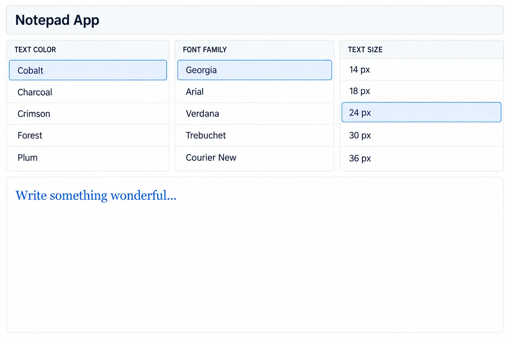

# Practice 4: Notepad

In this practice, we will build a full-page notepad and use Angular bindings to connect its formatting controls to the document on the screen.

The application will let the user edit a title and note, choose a font family and size, apply text styles, change the alignment, and select text and background colors. Every control will update the document immediately.



## Run the application

Start the development server:

```bash
ng serve
```

Open `http://localhost:4200/` in the browser.

## 1. Prepare the global styles

Open `src/styles.css` and prepare the application to fill the entire browser window.

Create a universal `*` selector that applies the following defaults to every element:

- Set `box-sizing` to `border-box`.
- Set the application's default font.
- Remove the default margin and padding.

Set both `html` and `body` to `100%` width and height. This gives the root component the full page to work with.

Finally, define CSS custom properties for the application's design tokens. Create tokens for the colors used by the page, controls, document, and text, as well as a small set of standard padding values. We will reuse these tokens throughout the component styles to keep the design consistent.

## 2. Create the view model

Open `src/app/app.ts` and create six signals to represent the available formatting options and the user's current selections:

- `colorOptions` stores the available colors.
- `selectedColor` stores the selected color.
- `fontOptions` stores the available fonts.
- `selectedFont` stores the selected font.
- `sizeOptions` stores the available text sizes.
- `selectedSize` stores the selected size.

Add three actions for changing the selected values:

- `selectColor` updates the selected color.
- `selectFont` updates the selected font.
- `selectSize` updates the selected size.

Keeping the options and selections in the component gives the template a single source of truth for rendering the controls and formatting the document.

## 3. Create the application layout

Open `src/app/app.html`, remove the Angular placeholder content, and create five areas for the notepad:

- `header-area`
- `colors-area`
- `fonts-area`
- `sizes-area`
- `content-area`

Then open `src/app/app.css` and organize these areas with CSS Grid. Assign each element to its matching named `grid-area`, and use `grid-template-areas` to define where the five areas appear in the full-page layout.

## 4. Render the selector options

Open `src/app/app.html` and use an `@for` block in each selector area:

- Loop over `colorOptions()` in the colors area.
- Loop over `fontOptions()` in the fonts area.
- Loop over `sizeOptions()` in the sizes area.

Create an element for every option and track each item by its value. Display each option in a way that makes its purpose clear, such as a color swatch or a text label.

Then open `src/app/app.css` and style how an option item looks. Give the items consistent dimensions, spacing, borders, while allowing each selector area to present its values appropriately.

## 5. Handle selection

Open `src/app/app.html` and connect each option item's click event to the matching action:

- Call `selectColor` from a color item and pass its color value.
- Call `selectFont` from a font item and pass its font value.
- Call `selectSize` from a size item and pass its size value.

Conditionally apply a `selected` class when an item's value matches its corresponding selected signal. Then open `src/app/app.css` and style this class so the selected item has a distinct appearance.

Test the interaction in the browser. Click items in each selector and confirm that the selected style moves to the item you clicked.

## 6. Bind the formatting to the document

Use style bindings to apply the selected visual state to the editable document:

- Bind the font family.
- Bind the text colors.
- Bind the text size.

When a signal changes, Angular will reevaluate the bindings and update the document automatically.
